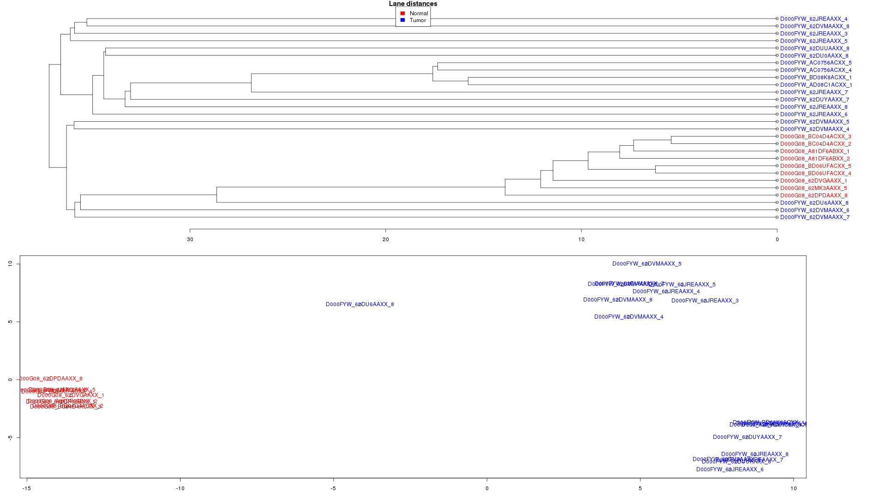
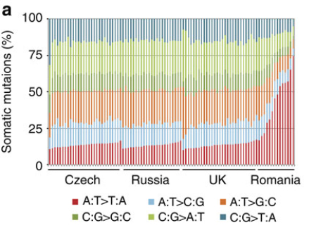
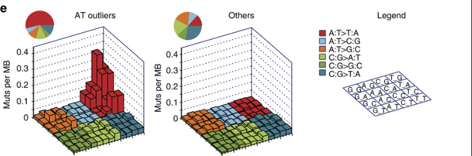
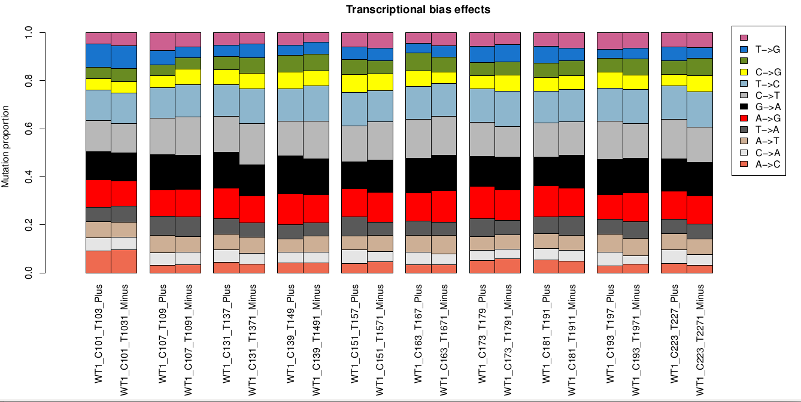

# Introduction to DNA-Seq processing for cancer data - Visualization
***By Mathieu Bourgey, Ph.D***

# Analysis of cancer data
This workshop will be a mix of different methods to look and explore your data.

We will be working on the same BAMs you generated from the SNV part.
Again, for practical reasons we subsampled the reads from the sample because running the whole dataset would take way too much time and resources.
This leads to some strange results in this part.

This work is licensed under a [Creative Commons Attribution-ShareAlike 3.0 Unported License](http://creativecommons.org/licenses/by-sa/3.0/deed.en_US). This means that you are able to copy, share and modify the work, as long as the result is distributed under the same license.

### Environment setup
We will need an updated bvatools for these exercises

```{.bash}

export APP_ROOT=/home/training/Applications/
export PICARD_JAR=$APP_ROOT/picard-tools/picard.jar
export SNPEFF_HOME=$APP_ROOT/snpEff/
export GATK_JAR=$APP_ROOT/gatk/GenomeAnalysisTK.jar
export BVATOOLS_JAR=$APP_ROOT/bvatools-1.6/bvatools-1.6-full.jar
export REF=/home/training/ebicancerworkshop201507/reference

```

### Software requirements
These are all already installed, but here are the original links.

  * [Genome MuSiC](http://gmt.genome.wustl.edu/genome-shipit/genome-music/current/)
  * [BVATools](https://bitbucket.org/mugqic/bvatools/downloads)
  * [SAMTools](http://sourceforge.net/projects/samtools/)
  * [IGV](http://www.broadinstitute.org/software/igv/download)
  * [Genome Analysis Toolkit](http://www.broadinstitute.org/gatk/)
  * [Picard](http://picard.sourceforge.net/)
  * [SnpEff](http://snpeff.sourceforge.net/)
  * [R]()

# Circular representation of your calls
Many tools are available to do this the most common know is circos. But circos is a really not user friendly. In this tutoriel we show you an easy alternative to build circular representation of genomic data.

First we nee to go in the folder to do the analysis

```{.bash}
cd /home/training/ebicancerworkshop201507/visualization/
```

Let see what is in this folder

```{.bash}
tree
```

 data/
  -- breakdancer.somatic.tsv
  -- mutec.somatic.vcf
  -- scones.somatic.30k.tsv
 src/
  -- commands.sh

Take a look of the data files.

These are data of the same paired sample that we worked on during the SNV pratical. But this time the data are not limitated to a short piece of the chromosome 9.


```{.bash}
less data/breakdancer.somatic.tsv
less data/mutec.somatic.vcf
less data/scones.somatic.30k.tsv
```


**What can you see fron this data ?**
[solution](solution/_data1.md)

**Why don't we use the vcf format for all type of call?**
[solution](solution/_data2.md)

**Did you notice something different from the SNV pratical ?**
[solution](solution/_data3.md)


The analysis will be done using the R program

```{.bash}
R
```

We will use the circlize package from the cran R project. This package is dedicated to generate circular plot and had the advantage to provide pre-build function for genomics data. One of the main advantage of this tools is the use of bed format as input data.


```{.bash}
library(circlize)
```

We need to set-up the generic graphical parameters 


```{.bash}
par(mar = c(1, 1, 1, 1))
circos.par("start.degree" = 90)
circos.par("track.height" = 0.05)
circos.par("canvas.xlim" = c(-1.3, 1.3), "canvas.ylim" = c(-1.3, 1.3))
```

Let's draw hg19 reference ideograms

```{.bash}
circos.initializeWithIdeogram(species = "hg19")
```


We can now draw 1 track for somatic mutations

```{.bash}
snv_tmp=read.table("data/mutec.somatic.vcf",comment.char="#")
snv=cbind(snv_tmp[,1:2],snv_tmp[,2]+1)
circos.genomicTrackPlotRegion(snv,stack=TRUE, panel.fun = function(region, value, ...) {
	circos.genomicPoints(region, value, cex = 0.05, pch = 9,col='orange' , ...)
})
```


Let's draw the 2 tracks for cnvs. One track for duplication in red and one blue track for deletion.

```{.bash}
cnv=read.table("data/scones.somatic.30k.tsv",header=T)
dup=cnv[cnv[,5]>2,]
del=cnv[cnv[,5]<2,]
circos.genomicTrackPlotRegion(dup, stack = TRUE,panel.fun = function(region, value, ...) {
        circos.genomicRect(region, value, col = "red",bg.border = NA, cex=1 , ...)
})
circos.genomicTrackPlotRegion(del, stack = TRUE,panel.fun = function(region, value, ...) {
        circos.genomicRect(region, value, col = "blue",bg.border = NA, cex=1 , ...)
})
```

We can cleary see a massive deletion in the chromosome 3, which is a very common observation for kidney cancer (85% of tumor)  


To  finsh we just need to draw 3 tracks + positional links to represent SVs

```{.bash}
sv=read.table("data/breakdancer.somatic.tsv",header=T)
typeE=c("DEL","INS","INV")
colE=c("blue","black","green")
for (i in 1:3) { 
        bed_list=sv[sv[,8]==typeE[i],c(3,4,5,7)]
        circos.genomicTrackPlotRegion(bed_list,stack=TRUE, panel.fun = function(region, value, ...) {
                circos.genomicPoints(region, value, cex = 0.5, pch = 16, col = colE[i], ...)
        })
}

bed1=data.frame(chr=as.character(as.vector(sv[sv[,8]=="TRA",3])),start=as.integer(as.vector(sv[sv[,8]=="TRA",4]-5)),end=as.integer(as.vector(sv[sv[,8]=="TRA",4]+5 )),value1=as.numeric(as.vector(rnorm(dim(sv[sv[,8]=="TRA",])[1]))))
bed2=data.frame(chr=as.character(as.vector(sv[sv[,8]=="TRA",6])),start=as.integer(as.vector(sv[sv[,8]=="TRA",5]-5)),end=as.integer(as.vector(sv[sv[,8]=="TRA",5]+5 )),value2=as.numeric(as.vector(rnorm(dim(sv[sv[,8]=="TRA",])[1]))))


if (dim(bed1)[1] > 0 & dim(bed2)[1] > 0) {
        for (i in 1:dim(bed1)[1]) {
                circos.link(bed1[i,1],bed1[i,2],bed2[i,1],bed2[i,2])
        }
}
```

A good graph needs title and legends

```{.bash}
title("Somatic calls (SNV - SV - CNV) of sample LR376")
legend(0.7,1.4,legend=c("SNV", "CNV-DUPLICATION","CNV-DELETION","SV-DELETION","SV-INSERTION","SV-INVERSION"),col=c("orange","red","blue","blue","black","green","red"),pch=c(16,15,15,16,16,16,16,16),cex=0.75,title="Tracks:",bty='n')
legend(0.6,0.95,legend="SV-TRANSLOCATION",col="black",lty=1,cex=0.75,lwd=1.2,bty='n')
```

you should obtain a plot like this one


Exercice:


**Generate the graph and save it into a pdf file** 
[solution](solution/_image1.md)


Finally exit R

```{.bash}
q("yes")
```


# Finding contamination
This is more to QC but it can be very helpful to find strange patterns in your samples.

Create output folder contamination

```{.bash}
mkdir -p contamination
```

Extract positions of somatic variants from the SNV pratical 

```{.bash}
grep SOMATIC ../SNV/pairedVariants/mutect.vcf \
 | awk 'BEGIN {OFS="\t"} NR > 1 {print $1 , $2 , $4 , $5}' \
 > contamination/mutect.snpPos.tsv
```

Now we have our positions, we need the read counts *per lane* for these positions.
BVATools does this

```{.bash}
for i in normal tumor
do
  mkdir -p contamination/${i}
  java -Xmx2G -jar $BVATOOLS_JAR basefreq \
    --pos contamination/mutect.snpPos.tsv \
    --bam ../SNV/alignment/${i}/${i}.sorted.dup.recal.bam \
    --out contamination/${i}/${i}.somaticSnpPos \
    --perRG
done
```

We can look at one of the files to see what basefreq extracted

```{.bash}
less  contamination/normal/normal.somaticSnpPos.normal_62DPDAAXX_8.alleleFreq.csv
```

Now we need to extract and format the data so we can create a PCA and some hierarchical clusters. to do this we will use a specific command of bvatools: clustfreq  


The command is really complicated when the number of readgroup is large. So we will first generate a part of the command on the screen 


```{.bash}
for i in contamination/*/*.somaticSnpPos*_?.alleleFreq.csv
do
  NAME=`echo $i | sed 's/.*somaticSnpPos.\(.*\).alleleFreq.csv/\1/g'`
  echo "--freq $NAME $i";done | tr '\n' ' '
done
```

We will then copy this output and paste it at the end of the command bvatools. You should obtain that:

```{.bash}
java -Xmx2G -jar $BVATOOLS_JAR clustfreq \
--snppos contamination/mutect.snpPos.tsv \
--threads 3 \
--prefix sampleComparison \
--outputFreq \
--freq normal_62DPDAAXX_8 contamination/normal/normal.somaticSnpPos.normal_62DPDAAXX_8.alleleFreq.csv \
--freq normal_62DVGAAXX_1 contamination/normal/normal.somaticSnpPos.normal_62DVGAAXX_1.alleleFreq.csv  \
--freq normal_62MK3AAXX_5 contamination/normal/normal.somaticSnpPos.normal_62MK3AAXX_5.alleleFreq.csv \
--freq normal_A81DF6ABXX_1 contamination/normal/normal.somaticSnpPos.normal_A81DF6ABXX_1.alleleFreq.csv \
--freq normal_A81DF6ABXX_2 contamination/normal/normal.somaticSnpPos.normal_A81DF6ABXX_2.alleleFreq.csv \
--freq normal_BC04D4ACXX_2 contamination/normal/normal.somaticSnpPos.normal_BC04D4ACXX_2.alleleFreq.csv  \
--freq normal_BC04D4ACXX_3 contamination/normal/normal.somaticSnpPos.normal_BC04D4ACXX_3.alleleFreq.csv \
--freq normal_BD06UFACXX_4 contamination/normal/normal.somaticSnpPos.normal_BD06UFACXX_4.alleleFreq.csv  \
--freq normal_BD06UFACXX_5 contamination/normal/normal.somaticSnpPos.normal_BD06UFACXX_5.alleleFreq.csv  \
--freq tumor_62DU0AAXX_8 contamination/tumor/tumor.somaticSnpPos.tumor_62DU0AAXX_8.alleleFreq.csv  \
--freq tumor_62DU6AAXX_8 contamination/tumor/tumor.somaticSnpPos.tumor_62DU6AAXX_8.alleleFreq.csv  \
--freq tumor_62DUUAAXX_8 contamination/tumor/tumor.somaticSnpPos.tumor_62DUUAAXX_8.alleleFreq.csv  \
--freq tumor_62DUYAAXX_7 contamination/tumor/tumor.somaticSnpPos.tumor_62DUYAAXX_7.alleleFreq.csv  \
--freq tumor_62DVMAAXX_4 contamination/tumor/tumor.somaticSnpPos.tumor_62DVMAAXX_4.alleleFreq.csv  \
--freq tumor_62DVMAAXX_5 contamination/tumor/tumor.somaticSnpPos.tumor_62DVMAAXX_5.alleleFreq.csv  \
--freq tumor_62DVMAAXX_6 contamination/tumor/tumor.somaticSnpPos.tumor_62DVMAAXX_6.alleleFreq.csv  \
--freq tumor_62DVMAAXX_7 contamination/tumor/tumor.somaticSnpPos.tumor_62DVMAAXX_7.alleleFreq.csv  \
--freq tumor_62DVMAAXX_8 contamination/tumor/tumor.somaticSnpPos.tumor_62DVMAAXX_8.alleleFreq.csv  \
--freq tumor_62JREAAXX_3 contamination/tumor/tumor.somaticSnpPos.tumor_62JREAAXX_3.alleleFreq.csv  \
--freq tumor_62JREAAXX_4 contamination/tumor/tumor.somaticSnpPos.tumor_62JREAAXX_4.alleleFreq.csv  \
--freq tumor_62JREAAXX_5 contamination/tumor/tumor.somaticSnpPos.tumor_62JREAAXX_5.alleleFreq.csv  \
--freq tumor_62JREAAXX_6 contamination/tumor/tumor.somaticSnpPos.tumor_62JREAAXX_6.alleleFreq.csv  \
--freq tumor_62JREAAXX_7 contamination/tumor/tumor.somaticSnpPos.tumor_62JREAAXX_7.alleleFreq.csv  \
--freq tumor_62JREAAXX_8 contamination/tumor/tumor.somaticSnpPos.tumor_62JREAAXX_8.alleleFreq.csv  \
--freq tumor_AC0756ACXX_4 contamination/tumor/tumor.somaticSnpPos.tumor_AC0756ACXX_4.alleleFreq.csv  \
--freq tumor_AC0756ACXX_5 contamination/tumor/tumor.somaticSnpPos.tumor_AC0756ACXX_5.alleleFreq.csv  \
--freq tumor_AD08C1ACXX_1 contamination/tumor/tumor.somaticSnpPos.tumor_AD08C1ACXX_1.alleleFreq.csv  \
--freq tumor_BD08K8ACXX_1 contamination/tumor/tumor.somaticSnpPos.tumor_BD08K8ACXX_1.alleleFreq.csv
```

Now you should have 2 files
sampleComparison.freq.csv
sampleComparison.dist.csv

One contains vectors of snp frequences, the other contains the pairwise Euclidean distance
Now let's plot the result in R

```{.bash}
R
```

First we need to implement a small function to assign different color to the library in function of which sample they belong to

```{.bash}
colLab <- function(n) {
    if (is.leaf(n)) {
        a <- attributes(n)
        labCol = c("blue");
        if(grepl("normal", a$label)) {
          labCol = c("red");
        }
        attr(n, "nodePar") <- c(a$nodePar, lab.col = labCol)
    }
    n
}
```

Load data, perform clutering and generate dendogram

```{.bash}
dataMatrix <- read.csv("sampleComparison.dist.csv", row.names=1, header=TRUE)
hc <- hclust(as.dist(dataMatrix));
hcd = as.dendrogram(hc)
```

colLab <- function(n) {
    if (is.leaf(n)) {
        a <- attributes(n)
        labCol = c("blue");
        if(grepl(normalName, a$label)) {
          labCol = c("red");
        }
        attr(n, "nodePar") <- c(a$nodePar, lab.col = labCol)
    }
    n
}

Assign color using dendrapply and the function we created previously

```{.bash}
clusDendro = dendrapply(hcd, colLab)
```

Generate PCA on the data

```{.bash}
data <- read.csv("sampleComparison.freq.csv", header=FALSE,row.names=1, colClasses=c("character", rep("numeric",17)))
colLanes <- rownames(data)
colLanes[grep("normal", colLanes, invert=TRUE)] <- "blue"
colLanes[grep("normal", colLanes)] <- "red"
pca <- prcomp(data)
```

Make plot: a pdf file containing the hierchical clustering (dendogram) + Screeplot + PCA (COMP1 vs. COMP2) + PCA (COMP2 vs. COMP3)

```{.bash}
pdf("sampleComparison.laneMix.pdf")
par(mar=c(3,3,1,12))
cols <- c("red","blue")
plot(clusDendro, main = "Lane distances", horiz=TRUE)
legend("top", legend = c("Normal","Tumor"), fill = cols, border = cols)

par(mar=c(1,1,1,1))
screeplot(pca, type="lines")
plot(pca$x[,1:2])
text(pca$x[,1:2], rownames(data), col=colLanes)
plot(pca$x[,2:3])
text(pca$x[,2:3], rownames(data), col=colLanes)
dev.off()
```

Finally exit R
```{.bash}
q("yes")
```

Look at the graphs.

Based on the subset of data we have here a potential library issue could be present.  


But when looking at the enitre set of somatic mutations we can this is not true.
  


You could do this directly in R but
1. The basefreq format is not simple to parse
2. When you have thousands of somatics, and/or hundreds of samples, R struggles to build de pairwise distance and the PCA. This is why we precompute it in java before.


# Other visualizations

Many other visualizations of cancer data are possible. we will not go further in this pratical. But here is non-exhaustive list of other interesting visualization of DNA-seq cancer data:  

1. Somatic mutation distribution by type 
2. Genomic context of somatic mutations  
3. Representation of a possible transcriptional bias for somatic mutation  


## Aknowledgments
This tutorial is an adaptation of the one created by Louis letourneau [here](https://github.com/lletourn/Workshops/tree/ebiCancerWorkshop201407doc/01-SNVCalling.md). I would like to thank and acknowledge Louis for this help and for sharing his material. The format of the tutorial has been inspired from Mar Gonzalez Porta. I also want to acknowledge Joel Fillon, Louis Letrouneau (again), Francois Lefebvre, Maxime Caron and Guillaume Bourque for the help in building these pipelines and working with all the various datasets.
