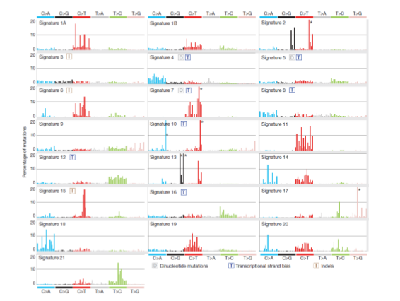

# Introduction to DNA-Seq processing for cancer data - Interpretation and Visualization
***By Mathieu Bourgey, Ph.D***

================================

This work is licensed under a [Creative Commons Attribution-ShareAlike 3.0 Unported License](http://creativecommons.org/licenses/by-sa/3.0/deed.en_US). This means that you are able to copy, share and modify the work, as long as the result is distributed under the same license.

====================================

## Key Learning Outcomes
After completing this practical the trainee should be able to:
 
 * Perform mutional signature analysis using R
 * Generate circos like graphics using R


## Resources You'll be Using

### Tools Used

 * [R](https://cran.r-project.org/)
 * [R package SomaticSignatures](https://bioconductor.org/packages/release/bioc/html/SomaticSignatures.html)
 * [R package BSgenome.Hsapiens.1000genomes.hs37d](http://bioconductor.org/packages/release/data/annotation/html/BSgenome.Hsapiens.1000genomes.hs37d5.html)
 * [R package ggplot2](http://ggplot2.org/)
 * [R package Cairo](https://cran.r-project.org/web/packages/Cairo/index.html)
 * [R package deconstructSigs](https://cran.rstudio.com/web/packages/deconstructSigs/index.html)
 * [R package circlize](https://cran.r-project.org/web/packages/circlize/index.html)
 
-----------------------------
# Somatic mutational signature analysis 

## Introduction
The most common genetic model for cancer development is the accumulation of DNA mutations over time, eventually leading to the disruption or dysregulation of enough key genes that lead cells to uncontrolled growth. Cells in our bodies accumulate DNA mutations over time due to normal aging processes, through exposure to carcinogens or through defects in the cell’s ability to repair mistakes. Recently researchers found a method to take all the single nucleotide mutations identified in tumour cells (somatic SNVs) and cluster them together by the type of the mutation and also what the neighbouring bases are. This is commonly referred to as somatic mutational signatures. 

Common mutational processes that are regularly identified in cancer sequencing are:
 - Age: the aging process. These are high in C/T transitions due to deamination of methyl-cytidine.
 - Smoking: marks exposure to inhaled carcinogens and has high numbers of C/A transversions.
 - UV: UV exposure. These are also high in C/T transitions at di-pyrimidine sites.
 - BRCA: Indicates that the homologous recombination repair pathway is defective.
 - APOBEC: Thought to be marking dysregulated APOBEC enzyme activity on single stranded DNA produced during the repair processing of other lesions such as double stand breaks.
 - MMR: Mismatch repair pathway not working properly. These are high in C/T mutations too.

 
In cohort cancer analysis it is common to try to generate subtypes to group your data based on a particular molecular phenotype. A reason for doing may include finding sets of patients that have a similar form of the disease and therefore all might benefit from a particular treatment. We can use the somatic mutational signatures analysis to group the data from a cohort of patients to inform which genomes are most similar based on the pattern of exposures or processes that have contributed to their genome changes. 

The mathematical framework developed by Alexandrov et al to cluster the somoatic mutations was implemented in MATLAB. We are going to use a version implemented in
R by Gehring et al, called SomaticSignatures package, that is very quick and flexible but currently only accepts point mutations not insertions or deletions (indels). In tests on our data we have found that the Somatic Signatures package in R returns very similar results to the full implementation of Alexandrov’s framework.

## Data Source
We will be working on a seven cancer sample. Some of them come from the CageKid project which is part of ICGC and is focused on renal cancer in many of it's forms and the other come from colon cancer. 


For practical reasons we precomputed the mutect somatic mutations vcf of each sample.

## Environment setup
Everything is already installed on your machine and the analysis will be run using the`R` analysis

```{.bash}
cd $HOME/ebicancerworkshop2017/Visualization/Signature
mkdir -p results

```


Let see what the data look like


```{.bash}
tree vcf/
```

> vcf/   
> ├── S01.mutect.somatic.vcf   
> ├── S02.mutect.somatic.vcf   
> ├── S03.mutect.somatic.vcf   
> ├── S04.mutect.somatic.vcf   
> ├── S05.mutect.somatic.vcf   
> ├── S06.mutect.somatic.vcf   
> └── S07.mutect.somatic.vcf   


we could explore one vcf file

```{.bash}
less vcf/S01.mutect.somatic.vcf

```

**What can we see from this vcf compared to the one generated in the first practical ?** [solution](solutions/_vcf1.md)


Now that we now what we are working on, we can start and prepare for the analysis

Just start by typing R onto the command line.

```{.bash}
R

```

Load all the package libraries needed for this analysis by running the commands.

```{.R}
library(SomaticSignatures)
library(BSgenome.Hsapiens.1000genomes.hs37d5)
library(ggplot2)
library(Cairo)

```
## Analysis


### loading mutation
Read in the mutations from the 7 vcf files

```{.R}
files <- list.files("vcf",pattern=".vcf$",recursive=T,full.names=TRUE)
files

```

> [1] "vcf/S01.mutect.somatic.vcf"   
> [2] "vcf/S02.mutect.somatic.vcf"   
> [3] "vcf/S03.mutect.somatic.vcf"   
> [4] "vcf/S04.mutect.somatic.vcf"   
> [5] "vcf/S05.mutect.somatic.vcf"   
> [6] "vcf/S06.mutect.somatic.vcf"   
> [7] "vcf/S07.mutect.somatic.vcf"   

Next we read in all the genomic positions of variants in the VCF files using the vranges class.

```{.R}
vranges <- lapply(files, function(v) readVcfAsVRanges(v,"hs37d5"))

```

Don't pay attention to the warnings

Now we can join all the lists of variant positions into one big data set so that it can be processed
together and look at what is contained in the concatenated vranges data

```{.R}
vranges.cat <- do.call(c,vranges)
vranges.cat

```
The first line of output of the vranges.cat shows us that in total we have put over 4,000 mutations. 
For each mutation we record between others:
 - the chromosome position
 - the mutation base changes 
 - the depths
 - the sample of origin 
 

We can print out how many mutations we have read in for each of the cancer samples we
are using by using the command.

```{.R}
print(table(sampleNames(vranges.cat)))

```

> S01 S02 S03 S04 S05 S06 S07   
> 921 485 233 846 967 793 539   


**Could you predict which sample belongs to kidney or colon cancers ?** [solution](solutions/_vcf3.md)

now we can use the reference and the position of the mutation to look up the bases on either side of the mutation i.e. the mutation context.


### adding mutation context
Run the mutationContext function of SomaticSignatures.

```{.R}
mc <- mutationContext(vranges.cat, BSgenome.Hsapiens.1000genomes.hs37d5)

```

It is always important to select the correct reference for your data.

**why ?** [solution](solutions/_vcf2.md)


We can inspect what information we had added to the vranges.cat objec

```{.R}
mc

```

Notice that the mutation and its context have been added to the last two columns


There are a total of 96 possible single base mutations and context combinations. We can calculate this by, first, listing out the six possible types of single nucleotide mutations: 

 - C/A the reverse compliment (G/T) is also in this group
 - C/G includes (G/C)
 - C/T includes (G/C)
 - T/A includes (A/T)
 - T/C includes (A/G)
 - T/G includes (A/C)


Then we can listing every of  mutation type using the neighbouring bases, on either side of a mutation, also referred to as the mutation context. 

There are 16 possible combinations of mutation contexts. Here [.] stands for one of the mutations listed above.

 - A[.]A A[.]C A[.]G A[.]T
 - C[.]A C[.]C C[.]G C[.]T
 - G[.]A G[.]C G[.]G G[.]T
 - T[.]A T[.]C T[.]G T[.]T

Now if we substitute the [.]’s with each of the 6 different mutations you will find there are
96 possible types of combined mutations and contexts (6 x 16).

**What about a mutation that looks like G[A/C]A, where should this go ?** [solution](solutions/_vcf4.md)

 
Now we have all the information that is needed for each sample we can make a matrix that contains counts of mutations in each of the 96 possible combinations of mutations and contexts counting up the totals separately for each sample 

```{.R}
mm <- motifMatrix(mc, group = "sampleNames", normalize=TRUE)
dim(mm)

```

> [1] 96  7

The output of the command show us that there are 96 rows (these are the context
values) and 7 columns which are the 7 samples.

## Running the NMF analysis

Using the matrix we have made we can now run the non-negative matrix factorisation (NMF) process that attempts to find the most stable, grouping solutions for all of the combinations of mutations and contexts. It does this by trying to find similar patterns, or profiles, amongst the samples to sort the data into firstly just 2 groups. This is repeated to get replicate values for each attempt and then separating the data by 3 groups, and then 4 and so on.


```{.R}
gof_nmf <- assessNumberSignatures(mm, 2:7, nReplicates = 5)

```

These parameter choices have been made to keep running time short for this practical !

Visualise the results from the NMF processing by making a pdf of the plot

```{.R}
Cairo(file="results/plotNumberOfSignatures.pdf", type="pdf", units="in", width=9, height=8, dpi=72)
plotNumberSignatures(gof_nmf)
dev.off()

```

Open up the PDF and examine the curve.


The top plot shows the decreasing residual sum of squares for each increasing number of signatures and the bottom plot the increasing explained variance as the number of potential signatures increases. 


Ideally the best solution will be the lowest number of signatures with a low RSS and a high explained variance


Look at the y-axis scale on the bottom panel. The explained variance is already very high and so close to finding the correct solution for the number of signatures even with just 2. The error bars around each point are fairly small considering we have a very small sample set. Deciding how many signatures are present can be tricky but here let’s go for 4. This is where the gradient of both curves start to become flaten.

Now we can run the NMF again but this time stipulating that you want to group the data into 4 different mutational signatures.

```{.R}
sigs_nmf = identifySignatures(mm, 4, nmfDecomposition)

```

## Making sens of sample signature

Let's try to cluster samples based on the signture decomposition. 

```{.R}
library(pheatmap)
Cairo(file="results/plot4Signatures_heatmat.pdf", type="pdf", units="in", width=9, height=6, dpi=72)
pheatmap(samples(sigs_nmf),cluster_cols=F, clustering_distance_cols = "correlation")
dev.off()

```
Open up the `plot4Signatures_heatmat.pdf` that will have been made.

**Are the coresponding cluster fiting with what we predict based on the number of mutation ?** [solution](solutions/_vcf5.md)

Now we can plot out the results for the individual samples in our dataset to show what
proportion of their mutations have been assigned to each of the signatures.

```{.R}
Cairo(file="results/PlotSampleContribution4Signatures.pdf", type="pdf", units="in", width=9, height=6, dpi=72)
plotSamples(sigs_nmf, normalize=TRUE) + scale_y_continuous(breaks=seq(0, 1, 0.2), expand = c(0,0))+ theme(axis.text.x = element_text(size=6))
dev.off()

```

Open the resulting `PlotSampleContribution4Signatures.pdf`. This shows the results for the mutation grouping for each sample. The samples are listed on the x-axis and the proportion of all mutations for that sample is shown on the y-axis. The colours of the bars indicate what proportion of the mutations for that sample were grouped into each of the signatures. The colour that makes up most of the bar for each sample is called its ”major signature”.


**Is the contribution plot make sens ?** [solution](solutions/_vcf6.md)


Now, we can visualise the shape of the profiles for these 4 signatures

```{.R}
Cairo(file="results/plot4Signatures.pdf", type="pdf", units="in", width=10, height=8, dpi=72)
plotSignatures(sigs_nmf,normalize=TRUE, percent=FALSE) + ggtitle("Somatic Signatures: NMF - Barchart") + scale_fill_brewer(palette = "Set2")
dev.off()

```

Open up the `plot4Signatures.pdf` that will have been made.


The 96 possible mutation/context combinations are plotted along the x axis arranged in blocks of 6 lots of 16 (see information above). The height of the bars indicates the frequency of those particular mutation and context combinations in each signature.


## Interpreting the signature results
In their paper __Alexandrov et al__ used this analysis to generate profiles from the data for more than 7000 tumour samples sequenced through both exome and whole genome approaches. They were able to group the data to reveal which genomes have been exposed to similar mutational processes contributing to the genome mutations. More information can be found on the signatures page of the COSMIC website.


  


**Can you match up, by eye, the profile shapes against a selection of known mutational signatures supplied ?** [solution](solutions/_signature1.md)


Unfortunately the SomaticSignatures package does not provide any autmated way to deconstruct the signal based on Alexandrov known signatures. To do this task we will need to use another R package, `deconstructSigs`, which implement that.

```{.R}
library(deconstructSigs)

```

First we need to reformat the data to  fit the `deconstructSigs` input format


```{.R}
sigs.input=as.data.frame(t(mm))
colnames(sigs.input)=c("A[C>A]A","A[C>A]C","A[C>A]G","A[C>A]T","C[C>A]A","C[C>A]C","C[C>A]G",
 "C[C>A]T","G[C>A]A","G[C>A]C","G[C>A]G","G[C>A]T","T[C>A]A","T[C>A]C",
 "T[C>A]G","T[C>A]T","A[C>G]A","A[C>G]C","A[C>G]G","A[C>G]T","C[C>G]A",
 "C[C>G]C","C[C>G]G","C[C>G]T","G[C>G]A","G[C>G]C","G[C>G]G","G[C>G]T",
 "T[C>G]A","T[C>G]C","T[C>G]G","T[C>G]T","A[C>T]A","A[C>T]C","A[C>T]G",
 "A[C>T]T","C[C>T]A","C[C>T]C","C[C>T]G","C[C>T]T","G[C>T]A","G[C>T]C",
 "G[C>T]G","G[C>T]T","T[C>T]A","T[C>T]C","T[C>T]G","T[C>T]T","A[T>A]A",
 "A[T>A]C","A[T>A]G","A[T>A]T","C[T>A]A","C[T>A]C","C[T>A]G","C[T>A]T",
 "G[T>A]A","G[T>A]C","G[T>A]G","G[T>A]T","T[T>A]A","T[T>A]C","T[T>A]G",
 "T[T>A]T","A[T>C]A","A[T>C]C","A[T>C]G","A[T>C]T","C[T>C]A","C[T>C]C",
 "C[T>C]G","C[T>C]T","G[T>C]A","G[T>C]C","G[T>C]G","G[T>C]T","T[T>C]A",
 "T[T>C]C","T[T>C]G","T[T>C]T","A[T>G]A","A[T>G]C","A[T>G]G","A[T>G]T",
 "C[T>G]A","C[T>G]C","C[T>G]G","C[T>G]T","G[T>G]A","G[T>G]C","G[T>G]G",
 "G[T>G]T","T[T>G]A","T[T>G]C","T[T>G]G","T[T>G]T")

```


We can now plot for each sample the contribution of known mutations
```{.R}
Cairo(file="results/PlotSampleDeconstructAlexandrov_pie.pdf", type="pdf", units="in", width=9, height=6, dpi=72)
layout(matrix(1:9,nrow=3,byrow=T))
for (i in rownames(sigs.input)) {
	output.sigs = whichSignatures(tumor.ref = sigs.input, signatures.ref = signatures.nature2013, sample.id = i)
	makePie(output.sigs)
}
dev.off()

```

Finally exit R

```{.R}
q("yes")
```


------------------------------
# Circular representation of somtaic calls

## Introduction
Many tools are available to do this the most common know is circos. But circos is a really not user friendly. In this tutoriel we show you an easy alternative to build circular representation of genomic data.

We will be working on 3 types of somatic calls: 

 * SNV calls from MuTect (vcf)
 * SV calls from DELLY (vcf)
 * CNV calls from SCoNEs (tsv)

## The environement

We will use a dataset derived from the analysis of whole genome sequencing paired normal/tumour samples


First we nee to go in the folder to do the analysis

```{.bash}
cd /home/training/ebicancerworkshop201507/vizu

```

Let see what is in this folder

```{.bash}
tree  data/vizu/

```

 data/vizu
  -- delly.somatic.vcf
  -- mutect.somatic.vcf
  -- scones.somatic.tsv
 src/
  -- commands.sh

Take a look of the data files.

```{.bash}
less data/vizu/delly.somatic.vcf
less data/vizu/mutect.somatic.vcf
less data/vizu/scones.somatic.tsv

```


**What can you see from this data ?**
[solution](solutions/_data1.md)

**Why don't we use the vcf format for all type of call?**
[solution](solutions/_data2.md)

**Did you notice something different from the SNV pratical ?**
[solution](solutions/_data3.md)


The analysis will be done using the R program

```{.bash}
R

```

# Circular representation of your calls

We will use the circlize package from the cran R project. This package is dedicated to generate circular plot and had the advantage to provide pre-build function for genomics data. One of the main advantage of this tools is the use of bed format as input data.


```{.R}
library(circlize)

```

Let's import the variants


```{.R}
snp=read.table("data/vizu/mutect.somatic.vcf",comment.char="#")
sv=read.table("data/vizu/delly.somatic.vcf")
cnv=read.table("data/vizu/scones.somatic.tsv",header=T)

```


We need to set-up the generic graphical parameters 


```{.R}
par(mar = c(1, 1, 1, 1))
circos.par("start.degree" = 90)
circos.par("track.height" = 0.05)
circos.par("canvas.xlim" = c(-1.3, 1.3), "canvas.ylim" = c(-1.3, 1.3))

```

Let's draw hg19 reference ideograms

```{.R}
circos.initializeWithIdeogram(species = "hg19")

```

Unfortunately circlize does not support b37/hg38 yet. So we will need to reformat our data to fit the hg19 standards
As we work only on autosomes we won't need to lift-over and we could simply add **chr** at the begin of the chromosome names


We can now draw 1 track for somatic mutations

```{.R}
snv=cbind(paste("chr",as.character(snp[,1]),sep=""),snp[2],snp[,2]+1)
circos.genomicTrackPlotRegion(snv,stack=TRUE, panel.fun = function(region, value, ...) {
    circos.genomicPoints(region, value, cex = 0.05, pch = 9,col='orange' , ...)
})

```


Let's draw the 2 tracks for cnvs. One track for duplication in red and one blue track for deletion.

```{.R}
dup=cnv[cnv[,5]>2,]
dup[,1]=paste("chr",as.character(dup[,1]),sep="")
del=cnv[cnv[,5]<2,]
del[,1]=paste("chr",as.character(del[,1]),sep="")
circos.genomicTrackPlotRegion(dup, stack = TRUE,panel.fun = function(region, value, ...) {
        circos.genomicRect(region, value, col = "red",bg.border = NA, cex=1 , ...)
})
circos.genomicTrackPlotRegion(del, stack = TRUE,panel.fun = function(region, value, ...) {
        circos.genomicRect(region, value, col = "blue",bg.border = NA, cex=1 , ...)
})

```

We can cleary see a massive deletion in the chromosome 3, which is a very common observation for kidney cancer (85% of tumor)  


To  finsh we just need to draw 3 tracks + positional links to represent SVs


Unfortunately the vcf format has not been designed for SVs. SVs are defined by 2 breakpoints and the vcf format store the second one in the info field. So we will need to extract this information to draw these calls.


```{.R}
chrEnd=NULL
posEnd=NULL
for (i in 1:dim(sv)[1]) {
    addInfo=strsplit(as.character(sv[i,8]),split=";")
    chrInf=strsplit(addInfo[[1]][3],split="=")
    chrEnd=c(chrEnd,chrInf[[1]][2])
    posInf=strsplit(addInfo[[1]][4],split="=")
    posEnd=c(posEnd,posInf[[1]][2])
}
svTable=data.frame(paste("chr",sv[,1],sep=""),as.numeric(sv[,2]),as.numeric(posEnd),paste("chr",chrEnd,sep=""),as.character(sv[,5]))

```
Now that we have reformated the SV calls, let's draw them


```{.R}
typeE=c("<DEL>","<INS>","<INV>")
colE=c("blue","black","green")
for (i in 1:3) {
        bed_list=svTable[svTable[,5]==typeE[i],]
        circos.genomicTrackPlotRegion(bed_list,stack=TRUE, panel.fun = function(region, value, ...) {
                circos.genomicPoints(region, value, cex = 0.5, pch = 16, col = colE[i], ...)
        })
}

bed1=cbind(svTable[svTable[,5]=="<TRA>",1:2],svTable[svTable[,5]=="<TRA>",2]+5)
bed2=cbind(svTable[svTable[,5]=="<TRA>",c(4,3)],svTable[svTable[,5]=="<TRA>",3]+5)


for (i in 1:dim(bed1)[1]) {
        circos.link(bed1[i,1],bed1[i,2],bed2[i,1],bed2[i,2])
}

```

A good graph needs title and legends

```{.R}
title("Somatic calls (SNV - SV - CNV)")
legend(0.7,1.4,legend=c("SNV", "CNV-DUPLICATION","CNV-DELETION","SV-DELETION","SV-INSERTION","SV-INVERSION"),col=c("orange","red","blue","blue","black","green","red"),pch=c(16,15,15,16,16,16,16,16),cex=0.75,title="Tracks:",bty='n')
legend(0.6,0.95,legend="SV-TRANSLOCATION",col="black",lty=1,cex=0.75,lwd=1.2,bty='n')

```

you should obtain a plot like this one


Exercice:


**Generate the graph and save it into a pdf file** 
[solution](solutions/_image1.md)


Finally exit R

```{.R}
q("yes")
```


# Other visualizations

Many other visualizations of cancer data are possible. we will not go further in this pratical. But here is non-exhaustive list of other interesting visualization of DNA-seq cancer data:  

1. Somatic mutation distribution by type 
2. Genomic context of somatic mutations  
3. Representation of a possible transcriptional bias for somatic mutation  


## Aknowledgments
I would like to thank and acknowledge Louis Letrouneau and Ann-Mary Patch for their help and for sharing his material. The format of the tutorial has been inspired from Mar Gonzalez Porta. I also want to acknowledge Joel Fillon, Louis Letrouneau (again), Robert Everleigh, Francois Lefebvre, Maxime Caron and Guillaume Bourque for the help in building our pipelines and working with all the various datasets.
