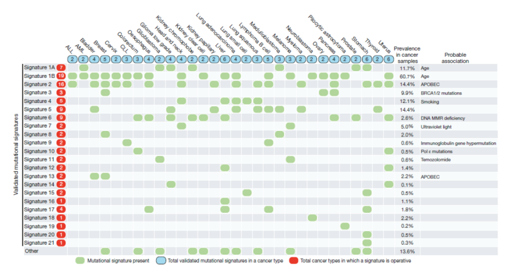

The 3 samples in the cluster seems to be driven by signature 3 which confirm our previous results. This signature is known to be related with BRACA1/2 mutations. These 3 samples are form the same type of cancer (Kidney)

The four other samples are the same type of cancer (Renal) but thess samples come from  different subtypes which can explain the difficulty to cluster them together. However these samples seem to be driven by signature 1 (A and B) which correspond to be related to the aging effect

