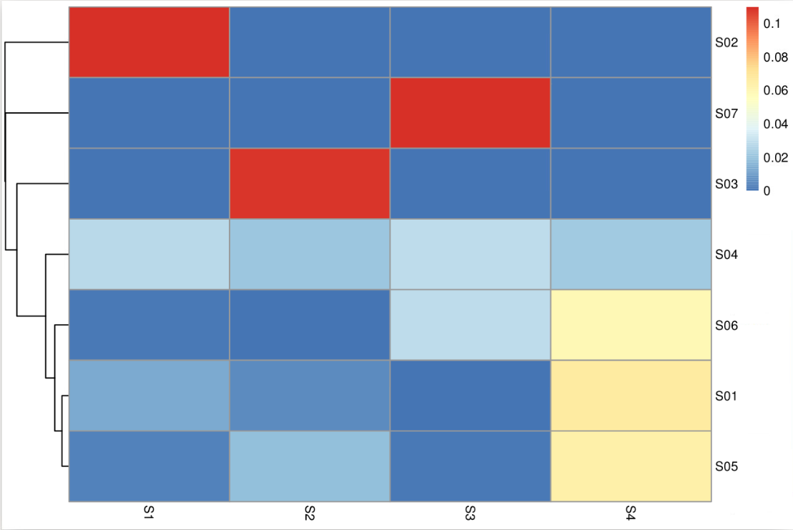

Based on somatic mutation number we predictat case S01, S04, S05 and  S06 would be clustered togther with high burden and S02, S03, S07 would be clustered as low burden.

If we look at the clustering based on the 4 mutational signatures

we could see 3 samples clustering toogether (S01, S05, S06). This clustering is mainly drived by the 4th signature. The 4 other samples seems different from the cluster but does not clearly cluster together.

