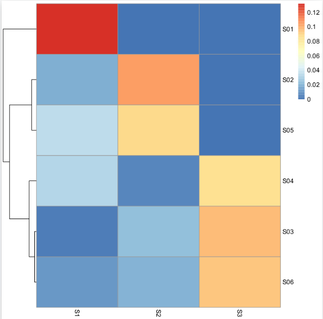

Based on somatic mutation number we predictat case S01, S04 and S05 would be clustered togther with low burden and S02, S03 and S06 would be clustered as high burden.

If we look at the clustering based on the 3 mutational signatures

we could see 3 groups of samples clustering together . The first cluster (S02 and S05) is mainly drived by the 2nd signature, the second cluster (S03, S04 and S06) is mainly drived by the 3rd signature. The last sample seems mainly drived by the 1st signature.

