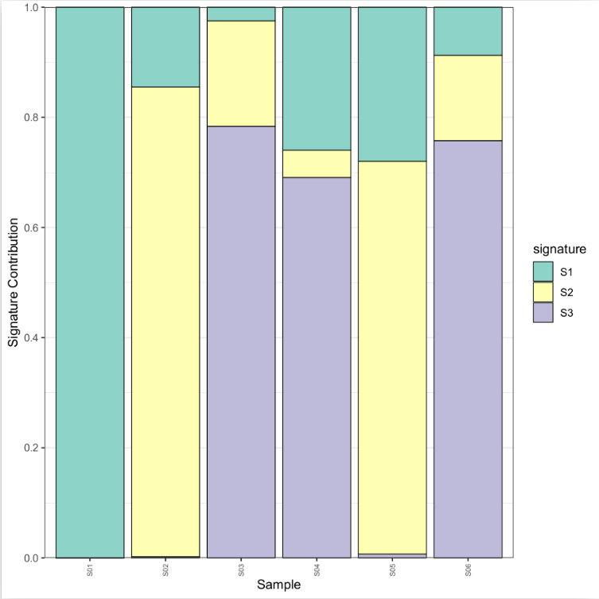

As we observed in the heatmap:  

 * We could see the 3 samples clustering toogether (S03, S04, S06) sharing the same 'major signature' S3.
 * We could see the 2 samples clustering toogether (S02, S05) sharing the same 'major signature' S2. But S2 is also presents in a lower proportion in S03, S04 and S06.
 * We could see the S01 showing only one signature S1. But S1 is also presents in a lower proportion in al the other sample
 

Interpreting the graph is a bit complicated at this stage but from the heatmap and the signature contribution we could probably define 2 groups: S03, S04, S06 vs S02, S05 + S01 which seems to have lower complex signatures.

