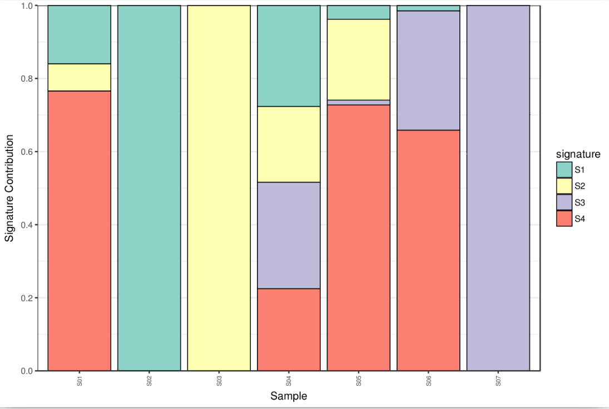

We could see the 3 samples clustering toogether (S01, S05, S06) sharing the same 'major signature' as we observed in the heatmap.

We could also see this signature is present in another sample: S04

S02, S03 and S07 only contain their specific major signature.

interpreting the graph is a bit complicated at this stage.

